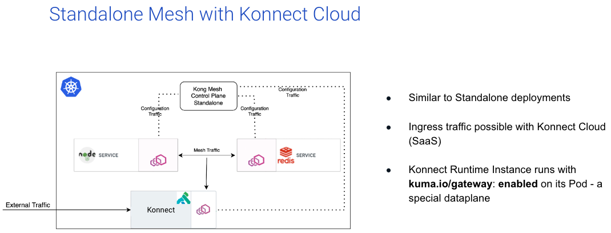

Installing Kong Mesh with Konnect on Amazon EKS
===========================================================

This example includes the installation on an EKS cluster, then manual steps to install Kong Mesh Enterprise on that cluster in Standalone mode.  It also provides instructions for setting up a Konnect delegated gateway, as well as includes examples with Kuma Demo App.



## Prerequisites
1. AWS Credentials (App ID and Password)
2. Terraform CLI
3. AWS CLI
4. Kong Mesh Enterprise license
5. Konnect login
6. Konnect Personal Access Token (pat)
7. decK CLI

## Procedure

### EKS install

Please follow the below instructions to install a vanilla instance of EKS:

1. Open `/tf-provision-eks/vpc.tf` to search & replace `simongreen` with your own name.  That way, all EKS objects will be tagged with your name making them easily searchable. Also, update the AWS region and credentials profile (line 7) in this file to the region of your choice.
2. Via the CLI, login to AWS using `aws configure`.
3. Via the CLI, `cd tf-provision-eks` then run the following Terraform commands to standup Amazon EKS:

```bash
terraform init
terraform apply
```

4. Once terraform has stoodup EKS, setup `kubectl` to point to your new EKS instance:

```bash
aws eks --region $(terraform output -raw region) update-kubeconfig --name $(terraform output -raw cluster_name)
kubectl get all
```

## Mesh Install Procedure

1. Insert your Enterprise license under `./license/license.json` of this directory.

2. Using `helm`, run the following command:

```bash
helm repo add kong-mesh https://kong.github.io/kong-mesh-charts
```

3. Using kubectl, run the following command:

```bash
 kubectl create namespace kong-mesh-system
```

4. Create the license secret:

```bash
 kubectl create secret generic kong-mesh-license -n kong-mesh-system --from-file=license/license.json
```

4. Install Kong Mesh:

```bash
helm repo update
helm upgrade -i -n kong-mesh-system kong-mesh kong-mesh/kong-mesh \
   --set 'kuma.controlPlane.secrets[0].Env="KMESH_LICENSE_INLINE"' \
   --set 'kuma.controlPlane.secrets[0].Secret="kong-mesh-license"' \
   --set 'kuma.controlPlane.secrets[0].Key="license.json"'
```

## Konnect Ingress Install Procedure

1. From the Konnect runtime instance page, copy the contents of the certificate and key to konnect/tls.crt and konnect/tls.key respectively.

2. Copy your Konnect pat to `konnect/konnect.pat`

3.  Create the namespace and secrets

```bash
kubectl create namespace kong
helm repo add kong https://charts.konghq.com
helm repo update
kubectl create secret tls kong-cluster-cert -n kong --cert=konnect/tls.crt --key=konnect/tls.key
```

4. Copy the configuration parameters from Konnect to `konnect/values.yaml`.

5.  Install (or upgrade) kong using the new configuration:

```bash
helm upgrade --install kong kong/kong -n kong --values konnect/values.yaml
```

6. Via the Konnect runtime instances page, ensure the new dataplane (runtime instance) has connected.

7. Via the CLI, figure out what the external IP is of the Konnect dataplane, by running the following command to retrieve the external hostname, then simply pinging the external hostname to get the IP:

```bash
kubectl get services --all-namespaces -o json | jq -r '.items[] | { name: .metadata.name, ns: .metadata.namespace, externalhostname: .status.loadBalancer?|.ingress[]?|.hostname  }'
ping <externalhostname>
```

8. Update `konnect/konnect-ingress.yaml` file with the external IP, by using search+replace on `999.999.999.999`.  Save the file.

9. Copy your Konnect personal access token (pat) to a file call `konnect/konnect.pat`

10.  Run `deck sync --konnect-runtime-group-name <insert runtime group name> --konnect-token-file konnect/konnect.pat --state=konnect/konnect-ingress.yaml` to create the Services and Routes.


11.  Via the Browser, copy the external address.  This will form your GUI URL: `http://mesh-gui.app.<external address>.nip.io/gui`

12.  Click through the wizard, choosing the Standalone deployment.  Next choose Kubernetes.  Then choose the Demo App.

13.  As per the instructions, copy the `kubectl` command and create the DemoApp in your cluster.

14. Via a new browser tab, copy the external address.  This will form your GUI URL: `http://demo-app.app.<external address>.nip.io`

## Enable mTLS

1. Enable mTLS using the following command:

```bash
kubectl apply -f konnect/mtls.yaml
```

## Create a Gateway ingress using Konnect dataplane

1. Via the Mesh GUI, navigate to Data Plane Proxies and click the **Create data plane proxy** button.

2. Select default mesh, then click **Next**.

3. In the namespace field, type `kong` which is where the Konnect dataplane ingress point is running.

4. Copy and paste the CRD that is generated and execute it via the CLI.

5. Give it a couple of minutes, as the pods need to restart.  After a short wait, you should now see 3 DP proxies on the dashboard, including the kong proxy apearing as `gateway_delegated`.

6. To test, navigate to `http://demo-app.app.<external address>.nip.io/` and you should be able to see the `Kuma Counter Demo 1.0` app.

## Demonstrate Multiple versions of the demo-app

It's useful to show different versions of a Kubernetes app and how we manage versions using the Mesh

1. If the demo app is already installed via the GUI wizard, delete the namespace:

```
kubectl delete ns kuma-counter-demo
```

2. Install demo v1:

```
kubectl apply -f mesh-demo/demo.yaml
```

3. Install demo v2:

```
kubectl apply -f mesh-demo/demo-v2.yaml
```

## Cleanup

1. Run the following command:

```
deck reset --konnect-token-file konnect/konnect.pat --konnect-runtime-group-name <insert runtime group name> --select-tag kong-mesh-ingress
```